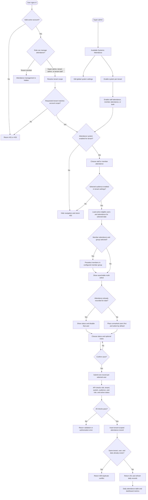
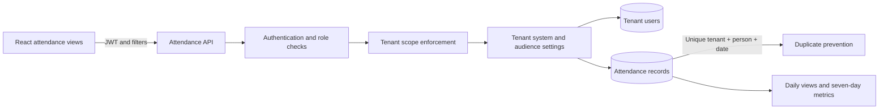

# Attendance System Flow

```mermaid
flowchart TD
    Start([User signs in]) --> Auth{Valid active account?}
    Auth -- No --> Denied[Return 401 or 403]
    Auth -- Yes --> Role{Role can manage attendance?}
    Role -- Tenant member --> NoAccess[Attendance management is hidden]
    Role -- Super admin, tenant admin, or tenant staff --> Tenant[Resolve tenant scope]
    Tenant --> Isolation{Requested tenant matches account scope?}
    Isolation -- No --> Denied
    Isolation -- Yes --> System{Attendance system enabled for tenant?}
    System -- No --> Disabled[Hide navigation and return 403]
    System -- Yes --> Audience[Choose staff or member attendance]
    Audience --> AudienceEnabled{Selected audience enabled in tenant settings?}
    AudienceEnabled -- No --> Disabled
    AudienceEnabled -- Yes --> Load[Load active eligible users and attendance for selected date]

    Load --> GroupChoice{Member attendance and group selected?}
    GroupChoice -- Yes --> Preselect[Preselect members in configured member group]
    GroupChoice -- No --> Select
    Preselect --> Select[Show searchable multi-select]
    Select --> Existing{Attendance already recorded for date?}
    Existing -- Yes --> Marked[Show status and disable that user]
    Existing -- No --> Unmarked[Place unmarked users first and select by default]
    Marked --> Form
    Unmarked --> Form[Choose status and optional notes]
    Form --> Confirm{Confirm save?}
    Confirm -- No --> Form
    Confirm -- Yes --> Submit[Submit one record per selected user]

    Submit --> ApiChecks[API checks role, tenant, system, audience, user role, and active status]
    ApiChecks --> Valid{All checks pass?}
    Valid -- No --> Error[Return validation or authorization error]
    Valid -- Yes --> Insert[Insert tenant-scoped attendance record]
    Insert --> Duplicate{Same tenant, user, and date already exists?}
    Duplicate -- Yes --> Conflict[Return 409 duplicate conflict]
    Duplicate -- No --> Saved[Return 201 and refresh daily records]
    Saved --> Daily[Daily attendance table and dashboard metrics]

    Super([Super admin]) --> Configure[Available Systems: Attendance]
    Configure --> SystemSettings[Edit global system settings]
    Configure --> TenantSettings[Enable system per tenant]
    TenantSettings --> AudienceSettings[Enable staff attendance, member attendance, or both]
    AudienceSettings --> System
```

## Main Data Boundary

```mermaid
flowchart LR
    UI[React attendance views] -->|JWT and filters| API[Attendance API]
    API --> AuthZ[Authentication and role checks]
    AuthZ --> Scope[Tenant scope enforcement]
    Scope --> Flags[Tenant system and audience settings]
    Flags --> Users[(Tenant users)]
    Flags --> Records[(Attendance records)]
    Records -->|Unique tenant + person + date| Constraint[Duplicate prevention]
    Records --> Dashboard[Daily views and seven-day metrics]
```
