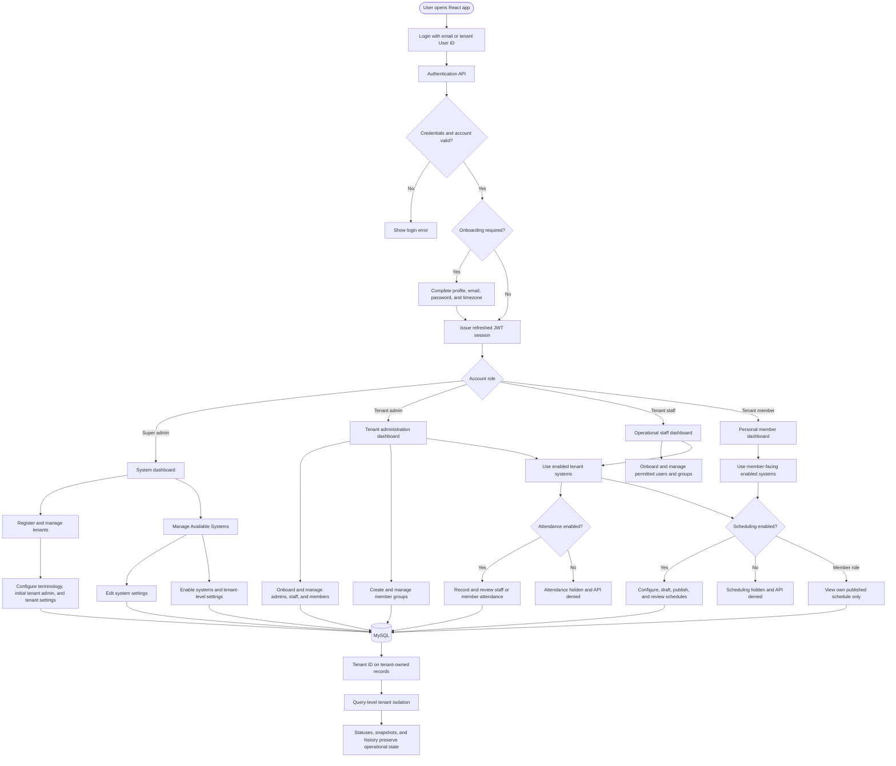
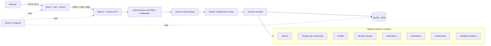
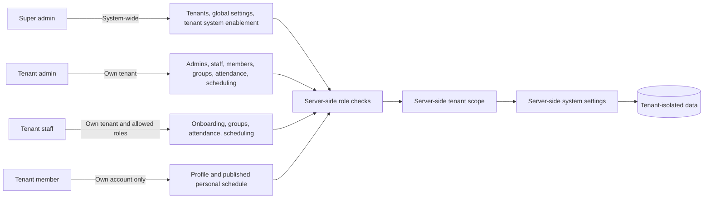

# Overall System Flow

```mermaid
flowchart TD
    Visitor([User opens React app]) --> Login[Login with email or tenant User ID]
    Login --> AuthAPI[Authentication API]
    AuthAPI --> Valid{Credentials and account valid?}
    Valid -- No --> LoginError[Show login error]
    Valid -- Yes --> FirstLogin{Onboarding required?}
    FirstLogin -- Yes --> Onboarding[Complete profile, email, password, and timezone]
    Onboarding --> Session[Issue refreshed JWT session]
    FirstLogin -- No --> Session
    Session --> Role{Account role}

    Role -- Super admin --> SuperDashboard[System dashboard]
    SuperDashboard --> Tenants[Register and manage tenants]
    SuperDashboard --> Systems[Manage Available Systems]
    Tenants --> TenantConfig[Configure terminology, initial tenant admin, and tenant settings]
    Systems --> GlobalSettings[Edit system settings]
    Systems --> Enablement[Enable systems and tenant-level settings]

    Role -- Tenant admin --> AdminDashboard[Tenant administration dashboard]
    AdminDashboard --> People[Onboard and manage admins, staff, and members]
    AdminDashboard --> Groups[Create and manage member groups]
    AdminDashboard --> EnabledModules

    Role -- Tenant staff --> StaffDashboard[Operational staff dashboard]
    StaffDashboard --> PeopleOps[Onboard and manage permitted users and groups]
    StaffDashboard --> EnabledModules[Use enabled tenant systems]

    Role -- Tenant member --> MemberDashboard[Personal member dashboard]
    MemberDashboard --> MemberModules[Use member-facing enabled systems]

    EnabledModules --> Attendance{Attendance enabled?}
    Attendance -- Yes --> AttendanceFlow[Record and review staff or member attendance]
    Attendance -- No --> HiddenA[Attendance hidden and API denied]
    EnabledModules --> Scheduling{Scheduling enabled?}
    Scheduling -- Yes --> ScheduleOps[Configure, draft, publish, and review schedules]
    Scheduling -- No --> HiddenS[Scheduling hidden and API denied]
    MemberModules --> Scheduling
    Scheduling -->|Member role| MySchedule[View own published schedule only]

    People --> Database
    Groups --> Database
    AttendanceFlow --> Database[(MySQL)]
    ScheduleOps --> Database
    MySchedule --> Database
    TenantConfig --> Database
    GlobalSettings --> Database
    Enablement --> Database

    Database --> Scope[Tenant ID on tenant-owned records]
    Scope --> Isolation[Query-level tenant isolation]
    Isolation --> Audit[Statuses, snapshots, and history preserve operational state]
```

## Runtime Architecture

```mermaid
flowchart LR
    Browser[Browser] -->|HTTP :5173| Frontend[React + Vite + HeroUI]
    Frontend -->|REST + JWT :4000| Backend[Node.js + Express API]
    Backend --> Auth[Authentication and RBAC middleware]
    Auth --> Tenant[Tenant scope policies]
    Tenant --> Systems[System enablement checks]
    Systems --> Domains[Domain modules]
    Domains --> MySQL[(MySQL :3306)]

    subgraph DomainModules[Backend domain modules]
        Clients[Clients]
        Users[People and onboarding]
        Profiles[Profiles]
        Groups[Member groups]
        Attendance[Attendance]
        Scheduling[Scheduling]
        Dashboards[Dashboards]
        AvailableSystems[Available Systems]
    end

    Domains --> DomainModules
    Compose[Docker Compose] -. runs .-> Frontend
    Compose -. runs .-> Backend
    Compose -. runs .-> MySQL
```

## Authorization Boundaries

```mermaid
flowchart LR
    Super[Super admin] -->|System-wide| ClientsAndSystems[Tenants, global settings, tenant system enablement]
    Admin[Tenant admin] -->|Own tenant| TenantManagement[Admins, staff, members, groups, attendance, scheduling]
    Staff[Tenant staff] -->|Own tenant and allowed roles| Operations[Onboarding, groups, attendance, scheduling]
    Member[Tenant member] -->|Own account only| Personal[Profile and published personal schedule]

    ClientsAndSystems --> RBAC[Server-side role checks]
    TenantManagement --> RBAC
    Operations --> RBAC
    Personal --> RBAC
    RBAC --> TenantScope[Server-side tenant scope]
    TenantScope --> SystemGate[Server-side system settings]
    SystemGate --> Data[(Tenant-isolated data)]
```
