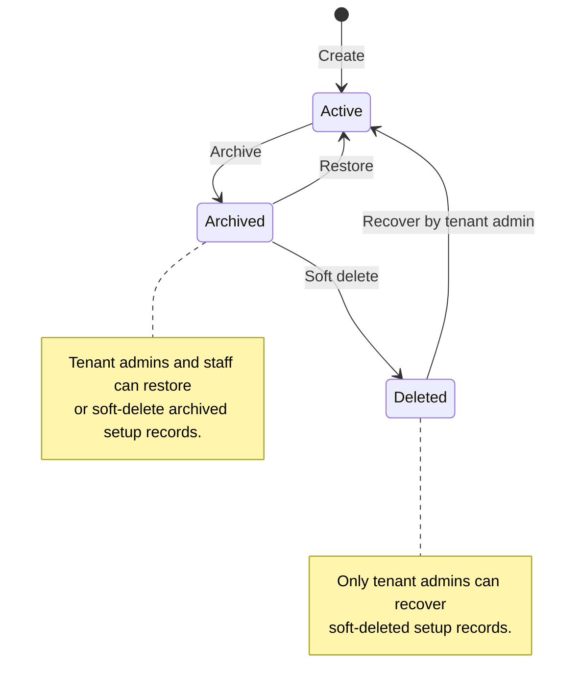

# Scheduling System Flow

```mermaid
flowchart TD
    Start([Tenant admin or staff opens Scheduling]) --> Gate{Scheduling enabled for tenant?}
    Gate -- No --> Disabled[Hide navigation and return 403]
    Gate -- Yes --> Choice{Choose workflow}

    Choice --> Setup[Schedule Setup]
    Setup --> Structure[Build unlimited-depth taxonomy tree]
    Structure --> Cycle{Would parent change create a cycle?}
    Cycle -- Yes --> Reject[Reject invalid tree change]
    Cycle -- No --> Slots[Configure ordered day slots]
    Slots --> Sessions[Create session templates with taxonomy path and session details]
    Sessions --> Weeks[Create seven-day by slot week templates]
    Weeks --> Ready[Reusable scheduling setup ready]

    Choice --> Create[Add Schedule]
    Ready --> Create
    Create --> Details[1. Enter name, period, dates, and optional week template]
    Details --> Grid[2. Review or edit the day and slot session grid]
    Grid --> Assign[3. Assign member groups and optional individual members]
    Assign --> Deduplicate[Resolve groups and direct members without duplicates]
    Deduplicate --> Review[4. Review generated dates and targets]
    Review --> Save{Save draft?}
    Save -- No --> Edit[Return to edit details, grid, or assignments]
    Save -- Yes --> Snapshot[Create plan and immutable occurrence snapshots]
    Snapshot --> Draft[(Draft schedule)]

    Draft --> DraftAction{Draft action}
    DraftAction -- Edit --> Regenerate[Update dates or targets and regenerate occurrences from saved snapshots]
    Regenerate --> Draft
    DraftAction -- Remove draft --> DeleteDraft[Delete draft and its draft occurrences]
    DraftAction -- Review publish --> ConflictScan[5. Resolve current members and scan active assignments]

    ConflictScan --> Conflicts{Same tenant, member, local date, and slot conflict?}
    Conflicts -- No --> PublishConfirm[Confirm publication]
    Conflicts -- Yes --> ConflictReview[Show conflicting assignments]
    ConflictReview --> Replace[Select assignments to replace]
    Replace --> AllResolved{Every conflict resolved?}
    AllResolved -- No --> ConflictReview
    AllResolved -- Yes --> PublishConfirm
    PublishConfirm --> Decision{Publish or cancel review?}
    Decision -- Cancel publish --> Draft
    Decision -- Publish --> Transaction[Transactional publication]
    Transaction --> Historical[Mark selected old assignments as replaced]
    Historical --> Assignments[Create active member assignments]
    Assignments --> Published[Mark occurrences and plan as published]
    Published --> Calendar[Staff calendar shows published sessions]

    Member([Tenant member]) --> MyGate{Scheduling enabled and assignment belongs to member?}
    MyGate -- No --> NoMemberAccess[Return 403 or 404]
    MyGate -- Yes --> MySchedule[My Schedule week or month view]
    Published --> MySchedule
    MySchedule --> Agenda[Show current and future active assignments]
    Agenda --> Detail[Open snapshotted session details]

    Calendar --> CancelAssignment{Cancel an active assignment?}
    CancelAssignment -- Yes --> Cancelled[Keep audit history and mark assignment cancelled]
    CancelAssignment -- No --> Calendar
```

## Resource Lifecycle

```mermaid
stateDiagram-v2
    [*] --> Active: Create
    Active --> Archived: Archive
    Archived --> Active: Restore
    Archived --> Deleted: Soft delete
    Deleted --> Active: Recover by tenant admin

    note right of Archived
      Tenant admins and staff can restore
      or soft-delete archived setup records.
    end note
    note right of Deleted
      Only tenant admins can recover
      soft-deleted setup records.
    end note
```
